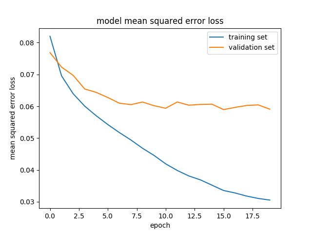
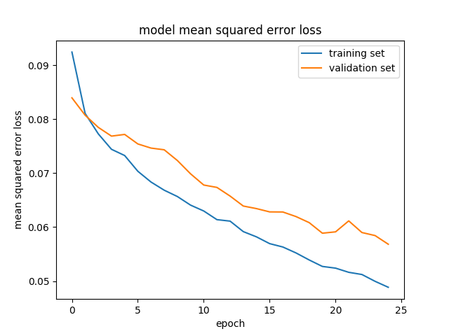

# **Behavioral Cloning** 

---

**Behavioral Cloning Project**

The goals / steps of this project are the following:
* Use the simulator to collect data of good driving behavior
* Build, a convolution neural network in Keras that predicts steering angles from images
* Train and validate the model with a training and validation set
* Test that the model successfully drives around track one without leaving the road
* Summarize the results with a written report


### Rubric Points

Here I will consider the [rubric points](https://review.udacity.com/#!/rubrics/432/view) individually and describe how I addressed each point in my implementation.  

---
#### Files Submitted & Code Quality

1. Submission includes all required files and can be used to run the simulator in autonomous mode

My project includes the following files:
* model.py containing the script to create and train the model
* drive.py for driving the car in autonomous mode
* model.h5 containing a trained convolution neural network 
* writeup_report.md or writeup_report.pdf summarizing the results

2. Submission includes functional code
Using the Udacity provided simulator and my drive.py file, the car can be driven autonomously around the track by executing 
```sh
python drive.py model.h5
```

3. Submission code is usable and readable

The model.py file contains the code for training and saving the convolution neural network. The file shows the pipeline I used for training and validating the model, and it contains comments to explain how the code works.

---

#### Model Architecture and Training Strategy

1. An appropriate model architecture has been employed

My model is a mini version of VGG net (model.py lines 82-99). It starts with 2 consecutive 5x5x32 convlutional layers using a 2x2 stride. Following that, there's a 2x2 overlapped max-poolling layer and a dropout layer. After that, there's another series of 2 consecutive 3x3x63 conv layers with a 1x1 stride + 2x2 overlapped max-pooling layer + dropout layer. The model ends with one output to indicate the steering amplitude after passing through 3 fully connected layers. The model also includes RELU layers to introduce nonlinearity after each convolutional layers.

2. Attempts to reduce overfitting in the model

As described in the previous section, the model contains dropout layers at the output of each conv+max-pool combo in order to reduce overfitting. 

The model was trained and validated on different data sets to ensure that the model was not overfitting (code line 144-152). The model was tested by running it through the simulator and ensuring that the vehicle could stay on the track.

3. Model parameter tuning

The model used an adam optimizer, so the learning rate was not tuned manually (model.py line 102).

4. Appropriate training data

Training data was chosen to keep the vehicle driving on the road. I used a combination of center lane driving, recovering from the left and right sides of the road and flipped images of each of them.


#### Design Procedures

1. Solution Design Approach

The overall strategy for deriving a model architecture is to 1) reduce the mean-square-error between the estimated steering angle and actual angle and 2) make sure the validation loss isn't going up again to avoid overfitting.

My first step was to use a convolution neural network model similar to the NVIDIA network. I thought this model might be appropriate because it has been proven to work well with actual camera data.

In order to gauge how well the model was working, I split my image and steering angle data into a training and validation set. I found that my first model had a low mean squared error on the training set but a high mean squared error on the validation set as shown in the figure below. Moreoever, the validation loss stayed high even when the training loss continued to decrease. This implied that the model was overfitting. 



To combat the overfitting, I first tried adding dropout layers at the output of every 2 convolutional layers. While it can help, I still found it insufficient to give me a good performance - i.e. I canno keep the car on the track.

Then I decided to try a different network - i.e. the one I used for my previous traffic sign classification project. It is essentially a mini-VGG net as described in the first bullet in the previous section. I am running the training on my local machine that hosts an NVIDIA GTX 750Ti GPU. Unfortunately, the GPU only has 2Gbyte of memory so I had to 1) shrink the image size by 4x (width and height each by 2x) and 2) choose a conv kernel size of 5 and stride of 2 for the first two conv layers. I tried to train my model on AWS too but the g2.2xlarge instance also has only 2G memory for the GPU so the same trimming is still needed.

Using adam optimizer to minimize the MSE on the steering value, I trained my model for 25 epochs over the dataset with a batch size of 64 within each epoch. Notice that I tried using the fit_generator method in Keras but I found the train loss and validation loss numbers were very strange. It was probably because I upgraded both my tensorflow and Keras to the latest version and something was broken. So eventually I decided to use the train_on_batch and the test_on_batch from Keras instead and wrote a seperate batch generation function. The batch size is again limited by my GPU memory.

The final step was to run the simulator to see how well the car was driving around track one. The car can stay on the track reasonably well, but there are still a a couple of driving oscillations as shown in the video below. 


2. Final Model Architecture

The final model architecture can be found in model.py lines 82-99. 


3. Creation of the Training Set & Training Process

To capture good driving behavior, I first recorded 6 laps on track one using center lane driving. I drove both clockwise and counter-clockwise, each 3 laps. I then recorded the vehicle recovering from the left side and right sides of the road back to center so that the vehicle would learn to recover its position when running away. Particuarlly, I recorded additional recovery images when the turn is near the water and hills.

Then I recorded two laps of clockwise and counter-clockwise driving on the second track to help avoid overfitting.

To augment the data sat, I also flipped images and angles thinking that this would give me more data to train and thus higher accuracy. Images are rescaled and normalized before sending to the CNN model.

I randomly shuffled the data set and put 20% of it as validation set to help determine if the model was over or under fitting. 

The loss vs. epoch for both train and validation set is shown in the figure below. As can be seen, starting from around epoch 19, the validation loss no longer drops as fast as the train loss which indicates the beginning of overfitting so I picked the saved model from epoch 19 as the final model for my test drive.


